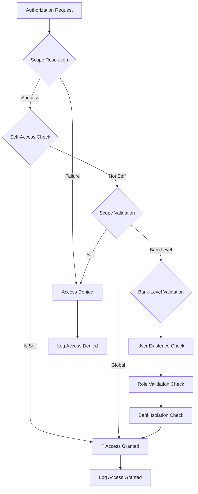

# Authorization System Organization - Complete Structure Guide

## ?? Overview

The authorization system has been completely reorganized using enums, constants, and proper ordering principles to create a maintainable, scalable, and well-documented security framework.

## ??? File Organization Structure

### Core Authorization Files (Ordered by Importance)

| **File** | **Purpose** | **Priority** | **Dependencies** |
|----------|-------------|--------------|------------------|
| `AuthorizationEnums.cs` | Core enum definitions | **Critical** | None |
| `AuthorizationConstants.cs` | Centralized constants | **High** | AuthorizationEnums.cs |
| `UserAuthorizationService.cs` | Main authorization logic | **High** | Both above files |
| `ModificationOperation.cs` | Operation enums | **Medium** | None |
| `Permission.cs` | Permission constants | **Medium** | None |

---

## ?? Enum Organization

### 1. AccessScope Enum (Hierarchical Order)

```csharp
public enum AccessScope
{
    Self = 1,        // Most Restrictive ? Clients
    BankLevel = 2,   // Moderately Restrictive ? Admins  
    Global = 3       // Least Restrictive ? SuperAdmins
}
```

**Usage Pattern:**
- **Self (1)**: Users can only access their own data
- **BankLevel (2)**: Users can access bank-scoped data with role restrictions
- **Global (3)**: Full system access without restrictions

### 2. AuthorizationCheckType Enum (Operation Order)

```csharp
public enum AuthorizationCheckType
{
    View = 1,         // Lowest Impact
    Create = 2,       // Medium Impact
    Modify = 3,       // High Impact
    Delete = 4,       // Highest Impact
    Administrate = 5  // Critical Impact
}
```

### 3. ValidationPriority Enum (Security Order)

```csharp
public enum ValidationPriority
{
    Critical = 1,     // Authentication, basic permissions
    High = 2,         // Ownership, scope validation
    Medium = 3,       // Business rules, data integrity
    Low = 4          // Logging, audit trail
}
```

---

## ??? Authorization Constants Organization

### Error Messages (Organized by Scenario)

```csharp
public static class ErrorMessages
{
    // Authentication & Basic Access (Priority 1)
    public const string NotAuthenticated = "User is not authenticated.";
    public const string InsufficientPermissions = "Insufficient permissions for this operation.";
    
    // Self-Access Restrictions (Priority 2)  
    public const string CannotDeleteSelf = "Users cannot delete themselves.";
    public const string CannotModifySelf = "Users cannot edit their own profile details (only password).";
    
    // Role-Based Access (Priority 3)
    public const string AdminsViewClientsOnly = "You can only access Client users.";
    public const string OnlyClientsCanBeModified = "Only Client users can be modified.";
    
    // Bank Isolation (Priority 4)
    public const string BankIsolationPolicy = "Access forbidden due to bank isolation policy.";
}
```

### Validation Rules (Organized by Priority)

```csharp
public static class ValidationRules
{
    public static readonly Dictionary<string, string> CriticalRules = new()
    {
        ["SELF_DELETE_BLOCKED"] = ErrorMessages.CannotDeleteSelf,
        ["AUTHENTICATION_REQUIRED"] = ErrorMessages.NotAuthenticated
    };
    
    public static readonly Dictionary<string, string> HighPriorityRules = new()
    {
        ["ADMIN_CLIENT_ONLY"] = ErrorMessages.AdminsViewClientsOnly,
        ["BANK_ISOLATION"] = ErrorMessages.BankIsolationPolicy
    };
}
```

---

## ?? UserAuthorizationService Organization

### Method Organization (Ordered by Impact Level)

#### 1. Public Interface (Ordered by Operation Impact)

```csharp
// LOW IMPACT: View operations
public async Task<Result> CanViewUserAsync(string targetUserId)

// MEDIUM IMPACT: Creation operations  
public async Task<Result> CanCreateUserAsync()

// HIGH IMPACT: Modification operations
public async Task<Result> CanModifyUserAsync(string targetUserId, UserModificationOperation operation)

// LOW IMPACT with HIGH DATA EXPOSURE: Filtering operations
public async Task<Result<(IEnumerable<ApplicationUser> Users, int TotalCount)>> FilterUsersAsync(...)
```

#### 2. Core Authorization Logic (Ordered by Validation Type)

```csharp
// PRIORITY 1: Self-access validation (bypasses all restrictions)
private async Task<Result> ValidateViewAuthorizationAsync(string targetUserId, AccessScope scope)

// PRIORITY 2: Scope-based validation with security layers
private async Task<Result> ValidateModificationAuthorizationAsync(...)

// PRIORITY 3: Creation validation  
private Result ValidateCreationAuthorization(AccessScope scope)
```

#### 3. Security Layers (Ordered by Restriction Level)

```csharp
// LAYER 1: Resource existence validation
private async Task<Result<ApplicationUser>> LoadTargetUserAsync(string targetUserId)

// LAYER 2: Role-based access validation
private async Task<Result> ValidateTargetUserRoleForViewAsync(string targetUserId)

// LAYER 3: Bank isolation validation  
// Handled by BankGuard.ValidateSameBank()
```

### 4. Self-Modification Rules (Ordered by Risk Level)

```csharp
private Result ValidateSelfModificationRules(ApplicationUser actingUser, string targetUserId, UserModificationOperation operation)
{
    return operation switch
    {
        // CRITICAL RISK: Account deletion prevention
        UserModificationOperation.Delete => Result.Forbidden(ErrorMessages.CannotDeleteSelf),
        
        // HIGH RISK: Profile modification restriction
        UserModificationOperation.Edit => Result.Forbidden(ErrorMessages.CannotModifySelf),
        
        // LOW RISK: Password change allowance
        UserModificationOperation.ChangePassword => Result.Success(),
        
        _ => Result.Forbidden("Operation not permitted on own account.")
    };
}
```

---

## ?? Filtering Logic Organization

### Data Filtering (Ordered by Scope Complexity)

```csharp
private async Task<Result<(IEnumerable<ApplicationUser> Users, int TotalCount)>> ApplyScopeFilteringAsync(...)
{
    var result = scope switch
    {
        // SIMPLE: Single user access
        AccessScope.Self => await ApplySelfFilteringAsync(...),
        
        // MEDIUM: Bank-scoped access with role filtering  
        AccessScope.BankLevel => await ApplyBankLevelFilteringAsync(...),
        
        // COMPLEX: Global access (no filtering)
        AccessScope.Global => await ApplyGlobalFilteringAsync(...),
        
        _ => (Users: Enumerable.Empty<ApplicationUser>(), TotalCount: 0)
    };
}
```

---

## ?? Logging Organization

### Logging Categories (Ordered by Importance)

```csharp
public static class LoggingCategories
{
    public const string CRITICAL_SECURITY = "[CRITICAL_SECURITY]";    // Highest priority
    public const string ACCESS_DENIED = "[ACCESS_DENIED]";            // High priority  
    public const string ACCESS_GRANTED = "[ACCESS_GRANTED]";          // Medium priority
    public const string AUTHORIZATION_CHECK = "[AUTHORIZATION]";      // Medium priority
    public const string BUSINESS_RULE = "[BUSINESS_RULE]";           // Low priority
    public const string SYSTEM_ERROR = "[SYSTEM_ERROR]";             // Variable priority
}
```

### Logging Methods (Ordered by Log Level)

```csharp
// HIGH PRIORITY: Authorization results with detailed context
private void LogAuthorizationResult(AuthorizationCheckType checkType, string? targetUserId, Result authResult, AccessScope scope, string? additionalInfo = null)

// MEDIUM PRIORITY: Data filtering results  
private void LogFilteringResult<T>(Result<T> filterResult, AccessScope scope, int pageNumber, int pageSize)

// LOW PRIORITY: Self-access granted (expected behavior)
private void LogSelfAccessGranted(AuthorizationCheckType checkType, string targetUserId)

// CRITICAL PRIORITY: System errors (unexpected behavior)
private void LogSystemError(string message, Exception? ex = null)
```

---

## ??? Security Flow Organization

### Authorization Flow (Ordered by Execution Priority)



### Validation Order (By Security Impact)

1. **CRITICAL**: Authentication & Scope Resolution
2. **HIGH**: Self-Access Bypass Check  
3. **HIGH**: User Existence Validation
4. **MEDIUM**: Role-Based Access Control
5. **MEDIUM**: Bank Isolation Policy
6. **LOW**: Logging & Audit Trail

---

## ?? Benefits of This Organization

### 1. **Maintainability** 
- Clear separation of concerns
- Consistent naming conventions
- Logical method ordering

### 2. **Scalability**
- Easy to add new scopes/roles
- Extensible enum structures  
- Modular validation logic

### 3. **Security**
- Priority-based validation
- Fail-safe defaults
- Comprehensive audit logging

### 4. **Readability**
- Self-documenting code structure
- Consistent error messages
- Clear validation flow

### 5. **Testability**
- Isolated validation methods
- Predictable error scenarios
- Comprehensive test coverage

---

## ?? Usage Examples

### Adding a New Access Scope

```csharp
// 1. Add to AuthorizationEnums.cs
public enum AccessScope
{
    Self = 1,
    BankLevel = 2,
    RegionalLevel = 3,  // NEW
    Global = 4
}

// 2. Update AuthorizationConstants.cs
public static readonly Dictionary<string, AccessScope> RoleScopes = new()
{
    ["Client"] = AccessScope.Self,
    ["Admin"] = AccessScope.BankLevel,  
    ["RegionalManager"] = AccessScope.RegionalLevel,  // NEW
    ["SuperAdmin"] = AccessScope.Global
};

// 3. Update UserAuthorizationService.cs validation methods
private async Task<Result> ValidateViewAuthorizationAsync(string targetUserId, AccessScope scope)
{
    return scope switch
    {
        AccessScope.Global => Result.Success(),
        AccessScope.RegionalLevel => await ValidateRegionalLevelViewAsync(targetUserId),  // NEW
        AccessScope.BankLevel => await ValidateBankLevelViewAsync(targetUserId),
        AccessScope.Self => ValidateSelfViewAuthorization(targetUserId),
        _ => Result.Forbidden(AuthorizationConstants.ErrorMessages.UnknownAccessScope)
    };
}
```

### Adding New Error Messages

```csharp
// Add to AuthorizationConstants.ErrorMessages
public const string RegionalAccessOnly = "You can only access users within your region.";

// Add to ValidationRules  
public static readonly Dictionary<string, string> HighPriorityRules = new()
{
    ["REGIONAL_ISOLATION"] = ErrorMessages.RegionalAccessOnly,  // NEW
    ["ADMIN_CLIENT_ONLY"] = ErrorMessages.AdminsViewClientsOnly,
    ["BANK_ISOLATION"] = ErrorMessages.BankIsolationPolicy
};
```

This organized structure provides a solid foundation for maintaining and extending the authorization system while ensuring security, performance, and code quality. ??